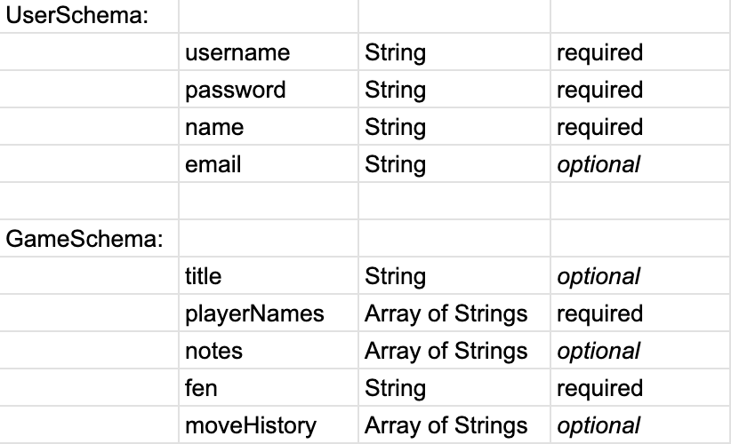

# ChessMixed

## About

For my Project #2, I'll be laying the CRUD foundation for an app called ChessMixed that I've had in  mind for a while, but haven't come close to being able to implement until now. For MVP, I'll be focusing on basic single user functionality, w/ an ambitious stretch goal to implement a 1v1 mode.

 *(The reason for the title "ChessMixed" will not become obvious until much later steps than for this week, but basically, I eventually want to build an app where you can play **Normal** chess OR **Whacky** chess with special player "powers" and random boardwide "events")*

## Project Planning

#### Trello Board: https://trello.com/b/2jvyZhZk/chess-project
#### ERD: 

#### Wireframes: 

## Technologies I'll be using

* html
* css
* js
* jQuery
* Express
* MongoDB / Mongoose
* [chess.js](https://github.com/jhlywa/chess.js/blob/master/README.md)
* [chessboard.js](https://chessboardjs.com)

