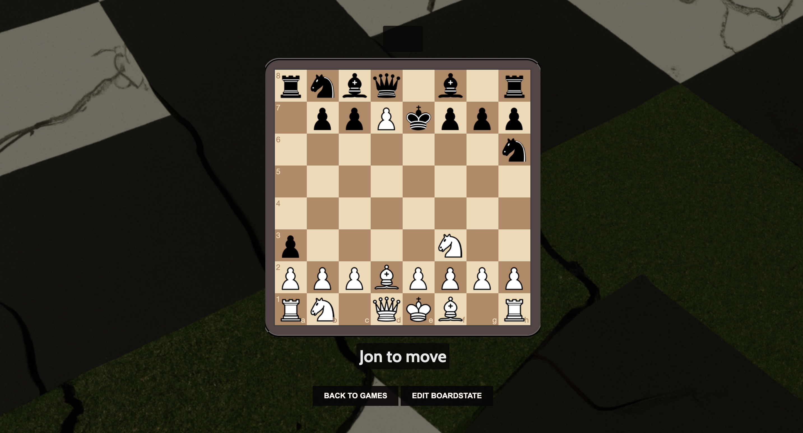

# CHESSMIXED

#### Link to active build on render.com: [https://chessmixed.onrender.com](https://chessmixed.onrender.com/)

## About

For my SEI Project #2, I've laid the CRUD foundation for an app called CHESSMIXED that I've had in mind for a while. For all the "chess stuff" in the code, I've integrated dedicated libraries: [chess.js](https://github.com/jhlywa/chess.js/blob/master/README.md) (which knows & implements all the rules) and [chessboard.js](https://chessboardjs.com) (ready-made DOM elements of board & pieces).

The reason for the title "chess-*mixed*" will not become obvious until much later development steps, but basically I want to build an app where you can play **Normal** chess -OR- **Whacky** chess, with special powers and boardwide events (gameplay akin to [Shotgun King](https://store.steampowered.com/app/1972440/Shotgun_King_The_Final_Checkmate/) or the little-known awesome tabletop game [Knightmare Chess](https://en.wikipedia.org/wiki/Knightmare_Chess))

 ## Screenshots _(8/22/23)_

#### Login page: 

#### Index page: 

#### Show page:
 
#### Edit page: 

## Technologies Used:

* html / css / js
* jQuery
* Node.js / Express
* MongoDB / Mongoose
* [chess.js](https://github.com/jhlywa/chess.js/blob/master/README.md)
* [chessboard.js](https://chessboardjs.com)
* *Future updates may utilize:*
    * [Stockfish](https://disservin.github.io/stockfish-docs/pages/Home.html) (open-source chess engine, to have a CPU opponent)
    * [Node-UCI](https://github.com/ebemunk/node-uci) (Universal Chess Engine, to parse Stockfish)
    * [Socket.IO](https://socket.io/docs/v4/) (to allow users to play against each other)
    * [OpenAI / GPT](https://platform.openai.com/docs/introduction) (for tips / suggestions based on gamestate & move history?)

## Getting Started

The working build of CHESSMIXED is being hosted [here](https://chessmixed.onrender.com/)
* Once you've created an account and logged in, you can use the button to create a new game, with either the default starting or any other legal position.
* You can also [seed two default games](https://chessmixed.onrender.com/games/seed) to your account's game list.

## Project Development

### Next Steps 

#### The next immediate steps will be enhancing the UI, with things like:
  * Visual history of captured pieces
  * Dialog boxes ("Are you sure?", etc)
  * Option to take back last move
  * Adding notes & optional title to game
#### Future upgrades, with current planned technologies:
* Making admin account
* Integrate [Stockfish](https://disservin.github.io/stockfish-docs/pages/Home.html) and [Node-UCI](https://github.com/ebemunk/node-uci) to have a CPU player
* Implement 1v1 multilpayer mode with [Socket.IO](https://socket.io/docs/v4/)
 * Querying good ol' GPT for game analyses, tips, etc
 * The "MIXED" part, i.e. a Whacky game mode with things like:
   * [fairy pieces](https://en.wikipedia.org/wiki/Fairy_chess_piece)
   * a system of aquired usable "powers" (like a hand of cards), to do things like morph one piece into another, bring one of your captured pieces back, or destroy an enemy piece
   * environmental obsticles, like one square now being a "swamp" (sliding pieces must end their move) or "hole" (only can be jumped over)

### Dev History

#### Trello Board: https://trello.com/b/2jvyZhZk/chess-project

#### Concept Wireframes: 

